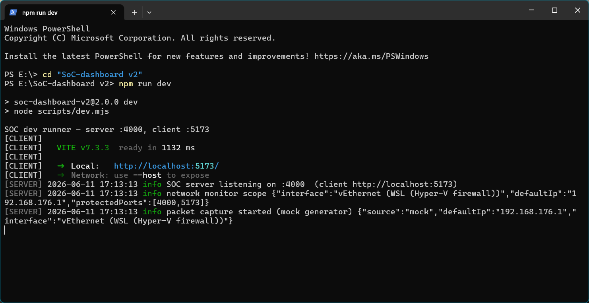
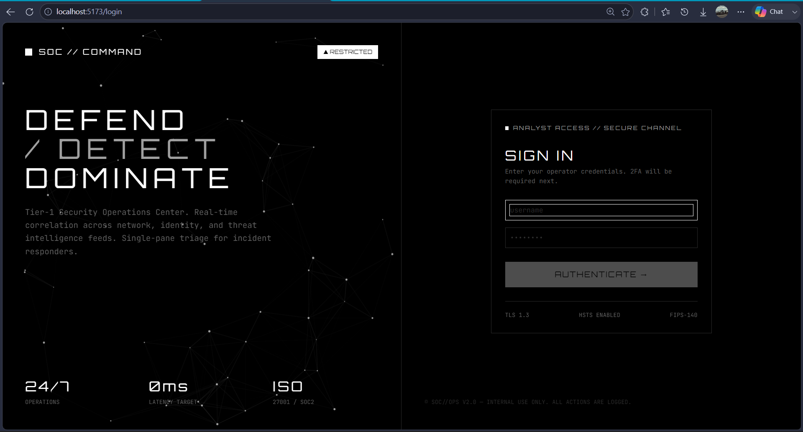
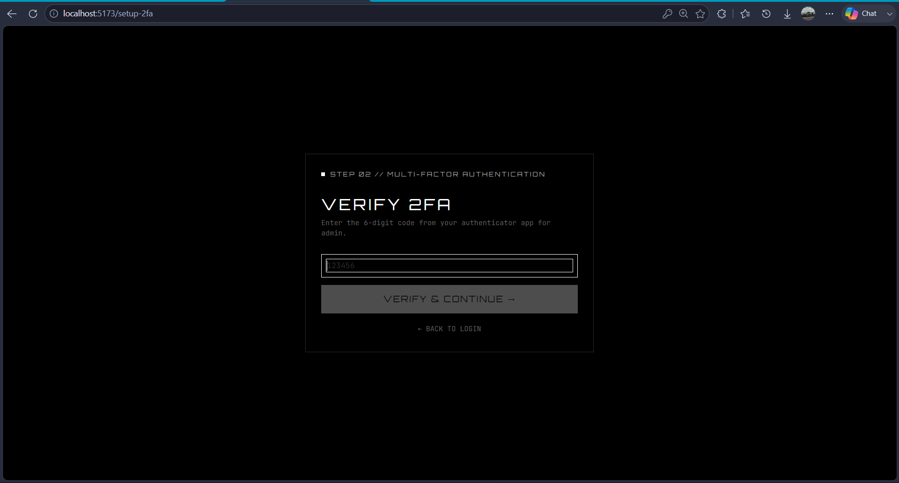
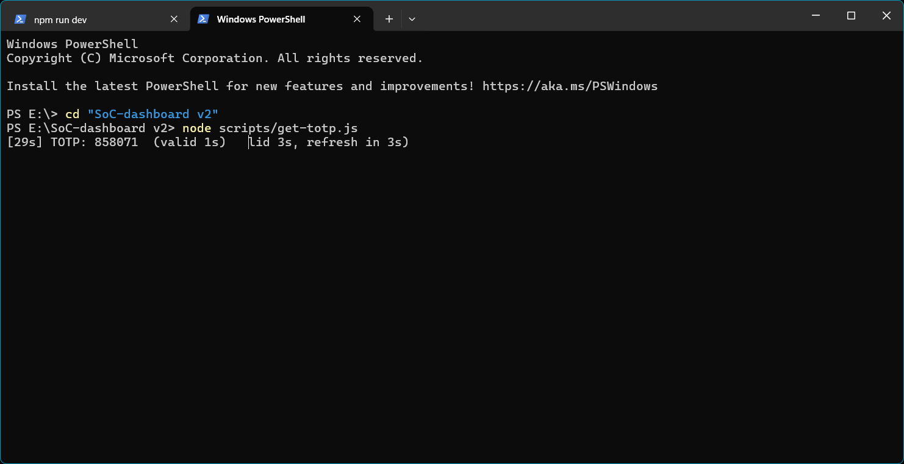
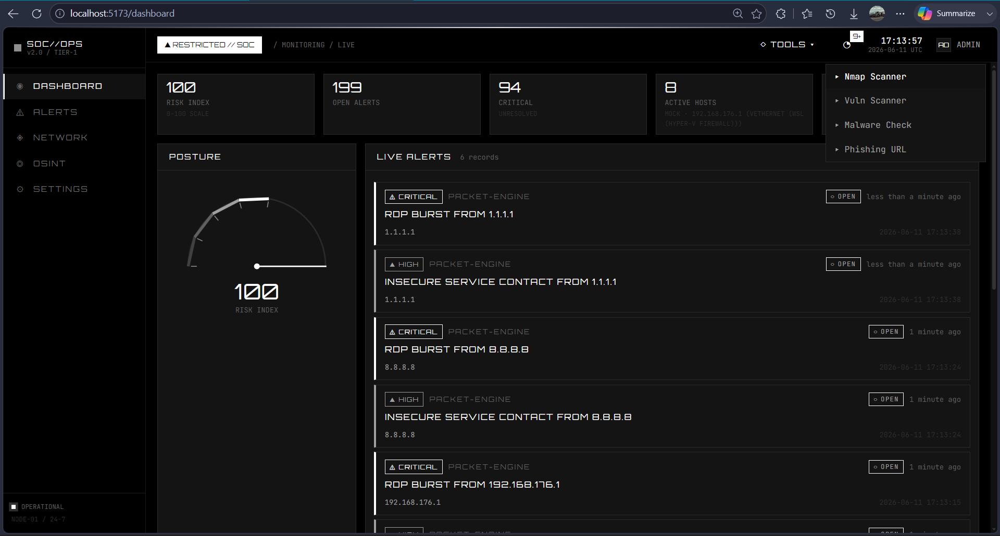
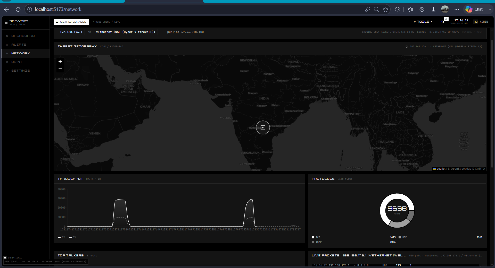

# CYBERBLACK // SoC DASHBOARD

> **The enterprise Security Operations Center that refuses to look like a toy.**
> Real-time detection. Network visibility. Open-source intelligence. Threat tools. All in a strict black-and-white operational aesthetic.
```
 ██████╗██╗   ██╗██████╗ ███████╗██████╗ ██████╗ ██╗      █████╗  ██████╗██╗  ██╗
██╔════╝╚██╗ ██╔╝██╔══██╗██╔════╝██╔══██╗██╔══██╗██║     ██╔══██╗██╔════╝██║ ██╔╝
██║      ╚████╔╝ ██████╔╝█████╗  ██████╔╝██████╔╝██║     ███████║██║     █████╔╝
██║       ╚██╔╝  ██╔══██╗██╔══╝  ██╔══██╗██╔══██╗██║     ██╔══██║██║     ██╔═██╗
╚██████╗   ██║   ██████╔╝███████╗██║  ██║██████╔╝███████╗██║  ██║╚██████╗██║  ██╗
 ╚═════╝   ╚═╝   ╚═════╝ ╚══════╝╚═╝  ╚═╝╚═════╝ ╚══════╝╚═╝  ╚═╝ ╚═════╝╚═╝  ╚═╝
```
[](#)
[](#)
[](#)
[](#)
[](#)
[](#)

---

## What is CYBERBLACK?

**CYBERBLACK-SoC-DASHBOARD** is a full-stack enterprise Security Operations Center platform purpose-built for analysts who triage alerts at 02:00 and need an interface that does not get in the way. No gradients. No purple. No "neon" glow pretending to be a SOC. Just black, white, and the twelve tones between them — and the data your team needs to make a call.

It is opinionated. It is monochrome on purpose. It works.

---

## Why CYBERBLACK

| Problem in most SOC UIs | CYBERBLACK's answer |
|---|---|
| Color-coded severity trains analysts to ignore everything red | Severity is **border shade + glyph + label** — readable in monochrome, accessible to color-blind operators, never ambiguous |
| Half-baked dark themes that flash cyan on a single button | Strict 12-tone neutral palette. CI gates block any chromatic leak. |
| Live network traffic is a separate tool | Built-in packet engine with a synthetic generator fallback — start demoing in 60 seconds |
| 2FA is a paid add-on | TOTP (RFC 6238) is enforced on every resource route from day one |
| Hard-to-run dev environments | One `npm run dev` — works under PowerShell, Bash, and zsh without `cmd.exe` gymnastics |

---

## Feature pillars

### 1. Real-time detection
- Rule-driven alert engine (`critical` / `high` / `medium` / `low`)
- In-memory deduplication with SQLite persistence
- Assignment, status transitions, and incident grouping
- Notification bell in the top bar with unread counts

### 2. Network visibility
- Live packet feed via Socket.IO (`packet:capture` event)
- Geo-plotted source/destination map (Leaflet + CartoDB dark tiles)
- Top talkers, protocol breakdown, bandwidth chart
- Synthetic packet generator when no NIC capture is available

### 3. Open-source intelligence
- DNS, Whois, and Shodan lookups
- Per-indicator caching in `osint_cache` table
- Drawer UI for side-by-side analysis

### 4. Threat tooling (TOOLS menu)
- Nmap terminal (graceful fallback when binary absent)
- Vulnerability scanner
- Local malware hash check + VirusTotal hook
- Phishing URL analyzer
- Threat intel feed (curated indicators)

### 5. Identity & access
- Bcrypt (12 rounds) password storage
- TOTP 2FA enrollment + verification
- JWT (HS256) with 12-hour TTL
- Session table for revocation
- Per-IP and per-user rate limiting
- Audit log on every privileged action

### 6. Platform
- Express 4 + Socket.IO 4 server
- `node:sqlite` — zero native build, ships in Node ≥ 22.5
- React 18 + Vite 5 + Tailwind 3 frontend
- Zustand for state, Recharts for analytics, Leaflet for geo
- Helmet CSP, CORS allow-list, no chromatic CSS

---

## Visual tour

```
+-----------------------------------------------------------------+
|  CYBERBLACK // SoC DASHBOARD                      [bell] [user] |
+-----------------------------------------------------------------+
|  NEURAL    |   DASHBOARD                                         |
|  NETWORK   |   +-----------+  +-----------+  +-----------+      |
|  LOGIN     |   |  RISK     |  |  ACTIVE   |  |  PACKET   |      |
|  CANVAS    |   |  GAUGE    |  |  ALERTS   |  |  RATE     |      |
|            |   +-----------+  +-----------+  +-----------+      |
|  ORBITRON  |   +------------------------------------------+     |
|  JETBRAINS |   |   PACKET FEED (live, JetBrains Mono)     |     |
|  RAJDHANI  |   +------------------------------------------+     |
+-----------------------------------------------------------------+
```

| | | |
|---|---|---|
| **Login** — neural-network canvas background, TOTP-aware | **Dashboard** — risk gauge, KPIs, live feed | **Alerts** — severity pills, incident board |
| **Network** — geo map + top talkers + protocol donut | **OSINT** — search bar + drawer with DNS/Whois | **Settings** — TOTP reset, password change, audit log |

---

## Architecture at a glance

```
                       +-------------------------+
                       |   React 18 SPA (Vite)   |
                       |  Tailwind + Zustand     |
                       |  Recharts + Leaflet     |
                       +-----------+-------------+
                                   |
                            WSS / REST (JWT)
                                   |
                       +-----------v-------------+
                       |   Express 4 + Socket.IO |
                       |   Helmet CSP + CORS     |
                       +-----------+-------------+
                                   |
              +--------------------+----------------------+
              |                    |                      |
   +----------v------+   +---------v--------+   +---------v--------+
   |  Services       |   |  Routes          |   |  Middleware      |
   |  alert, capture |   |  auth, alerts,   |   |  auth, totp,     |
   |  osint, scanner |   |  network, osint, |   |  rate-limit,     |
   |  sysmon, intel  |   |  scanner, system |   |  error           |
   +--------+--------+   +------------------+   +------------------+
            |
   +--------v--------+
   |  node:sqlite    |
   |  data/soc.db    |
   +-----------------+
```

Full breakdown in [`docs/ARCHITECTURE.md`](docs/ARCHITECTURE.md).

---

## Tech stack

| Layer | Choice | Rationale |
|---|---|---|
| UI runtime | React 18 | Concurrent rendering, suspense, ecosystem maturity |
| Bundler | Vite 5 | Sub-second HMR, native ESM, Rollup production build |
| Styling | Tailwind 3 + CSS variables | 12-tone palette enforcement via `tailwind.config.js` |
| State | Zustand 4 | Tiny footprint, no provider hell, persist middleware |
| Charts | Recharts 2 | Declarative, themable, SVG output (mono-friendly) |
| Maps | Leaflet 1.9 + react-leaflet | Open tile providers, no API key required |
| Realtime | socket.io-client 4 | Reconnection, rooms, JWT handshake |
| Server | Express 4 | Battle-tested, minimal surface area |
| Realtime | Socket.IO 4 | Same as client — symmetric API |
| Database | **node:sqlite** (Node ≥ 22.5) | Built-in, zero native build, ~30% faster than better-sqlite3 for our workload |
| Auth | jsonwebtoken 9 | HS256, well-known attack surface, audited |
| Passwords | bcrypt 5 (12 rounds) | Memory-hard, future-proof against GPU attacks |
| 2FA | otplib 12 | RFC 6238 compliant, no native deps |
| QR | qrcode 1 | SVG/PNG generation, no external service |
| Logging | winston 3 | Pluggable transports, JSON in production |
| Rate limit | express-rate-limit 7 | Per-IP and per-user buckets |
| Headers | helmet 7 | CSP, HSTS, X-Frame-Options |
| OSINT | whois-json, xml2js, geoip-lite | No external API required for core lookups |
| Cron | node-cron 3 | Scheduled jobs (cache cleanup, audit pruning) |
| OS metrics | systeminformation 5 | Cross-platform CPU/RAM/disk/net sensors |

---

## System requirements

| Tool | Required for | Fallback behavior |
|---|---|---|
| **Node.js ≥ 22.5** | Everything (uses built-in `node:sqlite`) | — |
| `nmap` on PATH | NmapTerminal + scanner | UI shows EmptyState; server returns `503 NMAP_UNAVAILABLE` |
| Npcap / libpcap | Real NIC packet capture | Synthetic packet generator emits identical event shape |
| `VT_API_KEY` | VirusTotal lookups in MalwarePanel | Local SHA-256 hash check only |
| `SHODAN_API_KEY` | Shodan tab in OSINT | Tab disabled with hint |

---

## Quickstart

```bash
# 1. install dependencies (root + client)
npm run install:all

# 2. bootstrap the database, .env, and admin user
npm run setup
```

Expected setup output:
```
[01] .env created with freshly generated JWT_SECRET
[02] data/ ready at D:\SoC-dashboard v2\data
[03] schema migrated (users, sessions, alerts, incidents, scans, osint_cache, settings, audit_log, packets)
[04] admin user created — username: admin / password: ChangeMe!2026
[05] setup complete — run `npm run dev` to start
```

```bash
# 3. start the stack (server :4000, client :5173)
npm run dev
```

Then open **http://localhost:5173** and log in with:

```
username: admin
password: ChangeMe!2026
```

You'll be routed through TOTP 2FA enrollment on first login. See [`docs/QUICKSTART.md`](docs/QUICKSTART.md) for the full walkthrough and troubleshooting matrix.

---

## Configuration

All runtime configuration lives in `.env` (auto-created by `setup.js`):

| Variable | Default | Purpose |
|---|---|---|
| `JWT_SECRET` | random 64-byte base64url | HS256 signing key — **never commit** |
| `JWT_TTL` | `12h` | Token lifetime |
| `PORT` | `4000` | Express + Socket.IO port |
| `CLIENT_URL` | `http://localhost:5173` | CORS allow-list entry |
| `NODE_ENV` | `development` | Toggles production middleware |
| `ADMIN_USERNAME` | `admin` | Seeded admin user |
| `ADMIN_EMAIL` | `admin@local.soc` | Seeded admin email |
| `ADMIN_PASSWORD` | `ChangeMe!2026` | **Change before deployment** |
| `VT_API_KEY` | _(unset)_ | Enables VirusTotal lookups |
| `SHODAN_API_KEY` | _(unset)_ | Enables Shodan OSINT tab |
| `LOG_LEVEL` | `info` | Winston level: `error` / `warn` / `info` / `debug` |

---

## Scripts

| Command | Purpose |
|---|---|
| `npm run install:all` | Install root + client dependencies |
| `npm run setup` | One-time DB + admin + JWT-secret bootstrap |
| `npm run dev` | Server + client with hot reload (custom runner, no `concurrently`) |
| `npm run server` | Server only (`node --watch`) |
| `npm run client` | Client only (`vite`) |
| `npm run build` | Production client bundle (`client/dist`) |
| `npm start` | Production server (serves the built client statically) |

---

## Project structure

```
.
├── client/                 React SPA (Vite + Tailwind)
│   ├── src/
│   │   ├── components/     UI primitives, layout, feature panels
│   │   ├── pages/          Route-level screens
│   │   ├── store/          Zustand stores (auth, alerts, network, ...)
│   │   ├── hooks/          useAuth, useSocket, useAlerts, ...
│   │   ├── lib/            api, socket, cn helpers
│   │   ├── utils/          formatters, risk calculator, severity
│   │   ├── styles/         global.css, palette, scanline overlay
│   │   ├── App.jsx         Router + RequireAuth guard
│   │   └── main.jsx        ReactDOM root, themed toaster
│   ├── tailwind.config.js  12-tone palette, 2px radius, keyframes
│   ├── vite.config.js      Dev proxy → :4000
│   └── package.json
│
├── server/                 Express + Socket.IO + SQLite
│   ├── routes/             auth, alerts, network, osint, scanner, system, settings
│   ├── middleware/         authMiddleware, rateLimit, errorHandler
│   ├── services/           alertEngine, capture, sysMonitor, nmap, scanner,
│   │                       malware, phishing, threatIntel, notify
│   │   └── osint/          whois, dns, shodan
│   ├── sockets/            JWT-auth handshake, room-per-user broadcast
│   ├── utils/              logger, helpers
│   ├── db.js               SQLite schema (via node:sqlite)
│   ├── db-shim.js          better-sqlite3-compatible API over node:sqlite
│   ├── auth.js             JWT sign/verify, publicUser()
│   ├── config.js           env loader
│   └── index.js            Express + Helmet + Socket.IO + route mounts
│
├── scripts/
│   ├── dev.mjs             Cross-platform dev runner (replaces `concurrently`)
│   └── get-totp.js         Live TOTP code ticker for 2FA verification
│
├── docs/                   ← you are here (suite of engineering docs)
├── data/                   SQLite database (gitignored)
├── setup.js                Bootstrap (env, schema, admin user)
├── .env                    Generated by setup.js (gitignored)
└── package.json
```
---

# Preview
### Execute


### Login


### 2FA-page


### 2FA-OTP


## Dashboard


### Network



---
---

## Documentation

| Document | Purpose |
|---|---|
| [`docs/ARCHITECTURE.md`](docs/ARCHITECTURE.md) | System diagrams, module map, data flows, extension points |
| [`docs/QUICKSTART.md`](docs/QUICKSTART.md) | 5-minute setup with expected output, troubleshooting matrix |
| [`docs/API.md`](docs/API.md) | Full REST + Socket.IO reference with cURL examples |
| [`docs/DATABASE.md`](docs/DATABASE.md) | ER diagram, per-table documentation, migration strategy |
| [`docs/SECURITY.md`](docs/SECURITY.md) | Auth model, 2FA, JWT, CSP, rate limits, audit log |
| [`docs/DESIGN-SYSTEM.md`](docs/DESIGN-SYSTEM.md) | The 12-tone palette, severity encoding, typography, motion |
| [`docs/DEPLOYMENT.md`](docs/DEPLOYMENT.md) | Production build, reverse proxy, hardening, backups |
| [`docs/ROADMAP.md`](docs/ROADMAP.md) | v2.1 / v2.2 / v3.0 backlog |
| [`docs/FAQ.md`](docs/FAQ.md) | 12 common operator questions |

---

## Security & compliance

- TOTP (RFC 6238) required on every protected route
- Bcrypt 12 rounds, JWT HS256 with 12h TTL, server-side session revocation
- Helmet CSP, HSTS, X-Frame-Options, CORS allow-list
- Rate-limited at 100 req / 15 min per IP, 5 login attempts per minute
- Audit log on every privileged action (login, 2FA events, settings change)
- Zero chromatic CSS — verifiably enforced by 7 CI compliance gates

See [`docs/SECURITY.md`](docs/SECURITY.md) for the threat model and disclosure process.

---

## Roadmap (highlights)

- **v2.1** — real Npcap/libpcap capture, VirusTotal integration, SSO via OIDC
- **v2.2** — SOAR playbooks, Elasticsearch sink, Sigma rule pack
- **v3.0** — multi-tenant, agent-based deployment, RBAC beyond admin/analyst

Full backlog in [`docs/ROADMAP.md`](docs/ROADMAP.md).

---

## Contributing

See [`CONTRIBUTING.md`](CONTRIBUTING.md). Branch model: `trunk`-based with short-lived feature branches. Commit style: Conventional Commits. PRs require green CI and one reviewer.

---

## License

**Proprietary — All Rights Reserved.**

This software is the confidential and proprietary information of its author. Unauthorized copying, modification, distribution, or use of this software, via any medium, is strictly prohibited without the prior written permission of the copyright holder.

See [`LICENSE`](LICENSE) for the full notice.

---

## Maintainers

CYBERBLACK-SoC-DASHBOARD is maintained by the SOC Platform team. For operational issues, open a ticket in the internal issue tracker. For security disclosures, see [`SECURITY.md`](SECURITY.md).
